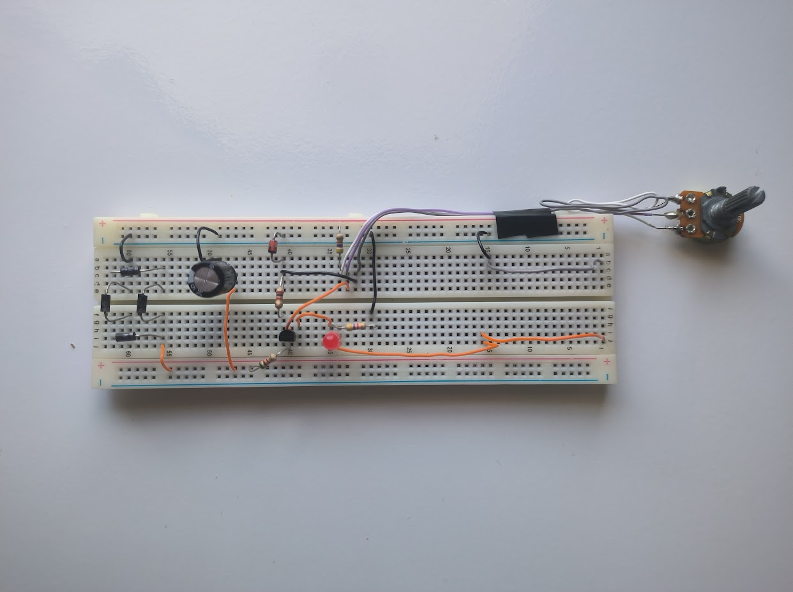
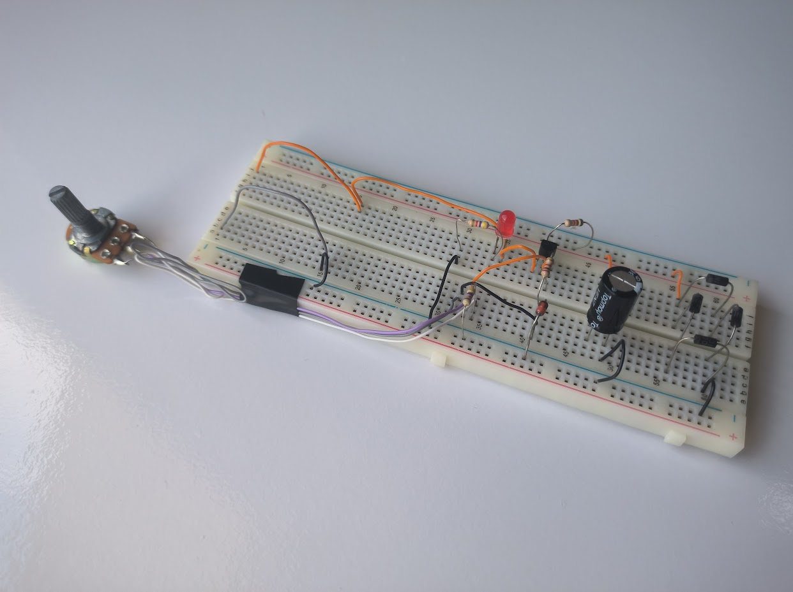
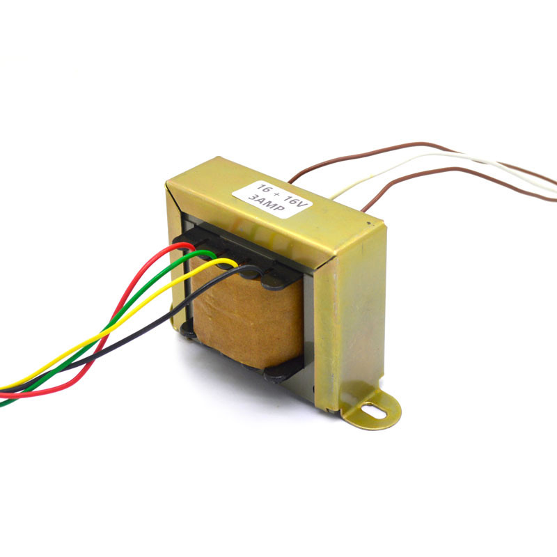
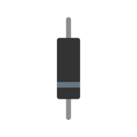
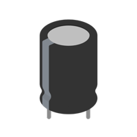
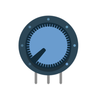
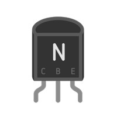
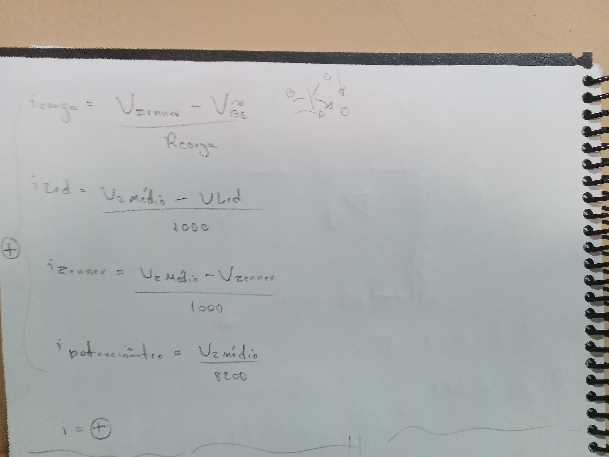
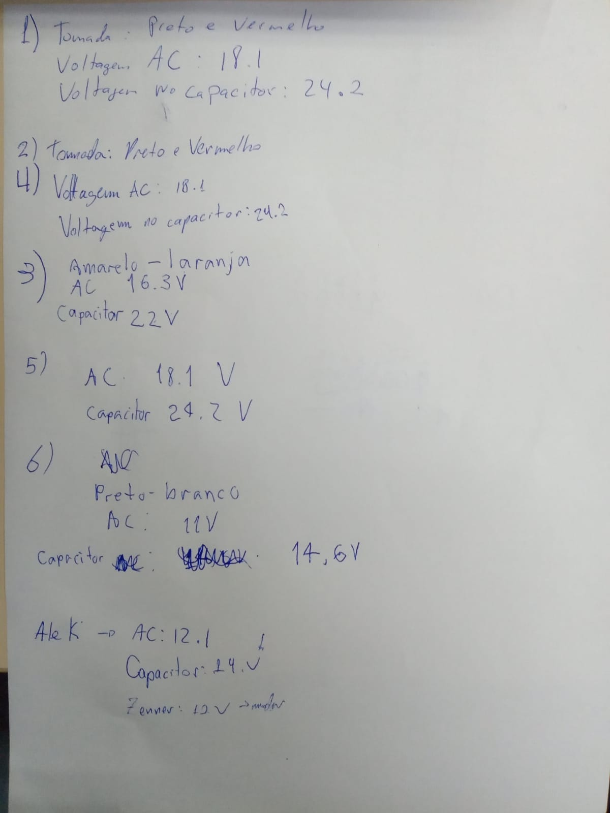

# Fonte Ajustável

## Descrição

Este é o primeiro trabalho de Eletrônica para Computação, que envolve a criação de uma Fonte de Tensão ajustável entre 3V a 12V com capacidade de 100mA. É burro friendly, então seja bem-vindo 🤓.

## Componentes Utilizados

| Nº Componente | Componente      | Especificação                  | Link para explicação detalhada                             |
| ------------- | --------------- | ------------------------------ | ---------------------------------------------------------- |
| 1             | Fonte           | Corrente Alternada 2 Terminais | [Explicação da Fonte CA](#explicacao_fonte)                |
| 1             | Transformador   | Razão: 6.979                   | [Explicação do Transformador](#explicacao_trans)           |
| 4             | Diodo           | 1N4004/1N4001                  | [Explicação do Diodo](#explicacao_diodo)                   |
| 1             | Capacitor       | 680uF com ≈ 24.2V              | [Explicação do Capacitor](#explicacao_capacitor)           |
| 1             | Diodo Zener -12 | 12,7V/13V                      | [Explicação do Diodo Zener](#explicacao_diodo_zener)       |
| 1             | Potenciômetro   | 10k                            | [Explicação do Potenciômetro](#explicacao_potenciometro)   |
| 4             | Resistores      | De 8.2KΩ à 120Ω                | [Explicação dos Resistores](#explicacao_resistores)        |
| 1             | LED Vermelho    | 5mm                            | [Explicação do LED Vermelho](#explicacao_led)              |
| 1             | Transistor      | NPN - bc337 uso geral - até 0,8A| [Explicação do Transistor NPN](#explicacao_transistor_npn) |

### Resistores

| Resistores Ω | Especificação |
| ------------ | ------------- |
| 8.2KΩ        | LED           |
| 2.7KΩ        | Diodo Zenner  |
| 5.3KΩ        | Potenciômetro |

## Imagens do Projeto

## Explicações do uso dos componentes:

(Veja a explicação em vídeo)[https://youtu.be/Pt6J5xYUrL0?si=UYq0Yr0lrQ63-2Zr]

#### Fonte

- A fonte aqui faz simulação de tomada, direto de Itaipu, que ao passar pelo transformador, como tem em alguns postes de luz (só que maior), "reduz" a tensão máxima antes de passar por ele, que é de 180V, para uma nova, mais aceitável e que usamos no resto do circuito.

#### Transformador

- O transformador aqui faria com que a corrente alternada advinda da fonte alternada, fazendo com que com a tensão máxima de 180V, "vinda da tomada", se "transforme" pela relação de espiras, na diferença de potencial que o nosso transformador na vida real tem, para o resto do circuito.

#### Diodo 

- O diodo é um dispositivo que aqui será usado em conjunto, atuando 4 de uma vez na mesma área, porém, afetando todo o circuito. Esse conjunto é chamado de ponte de diodo, quando, claro, colocado em um circuito daquela forma. No circuito em si, é configurado como uma ponte retificadora, que converte corrente alternada em corrente contínua.

#### Capacitor

- O capacitor é utilizado para armazenar cargas elétricas e fornecer energia ao circuito quando necessário. No caso da fonte ajustável, ele ajuda a suavizar as flutuações de tensão e a estabilizar a saída.

#### Diodo Zener

- O diodo Zener é usado para regular a tensão no circuito. Ele permite que uma tensão específica seja mantida através dele, protegendo os componentes do circuito contra picos de tensão.

#### Potenciômetro

- O potenciômetro é um resistor variável que permite ajustar a tensão de saída da fonte conforme necessário. Ele é essencial para garantir que a fonte seja ajustável entre 3V a 12V.

#### Resistores

- O primeiro será para o LED, fazendo com que não passe uma potência tão grande;
  - O segundo será para o Diodo Zenner, já que para este, a tensão não deve ser tão alta, nem tão baixa também por causa da corrente mínima que o Zenner-12 requer;
    - O terceiro será para o final, fazendo com que, passado pelo Coletor do Transistor NPN, a tensão "original" com 100mA e 24V passe por este resistor de 120, chegando no final com 12V e 100mA;
      - E o quarto, e último, seria para limitarmos a queda de tensão no potenciômetro, indo de 12V para o mínimo de 3V, ao invés de 3mV.

#### LED Vermelho

- Os LEDs vermelhos são usados para indicar visualmente o funcionamento do circuito. Eles acendem quando a fonte de alimentação está ligada e funcionando corretamente.

#### Transistor NPN

- O transistor NPN aqui serve para a resolução do resistor do Zenner, já que queremos que ao final tenhamos 100mA e conservemos a voltagem "original", porém com 12V no final, sem ter o problema do Zenner-12 se alimentar um pouco desses 12V e não ter a tensão mínima requerida no final, enquanto mantém também esses 100mA. Ele está ali então para regular a corrente, como um duto desta.

### Imagem do Circuito no Falstad

### Imagens de Cálculos:

### Transformadores

