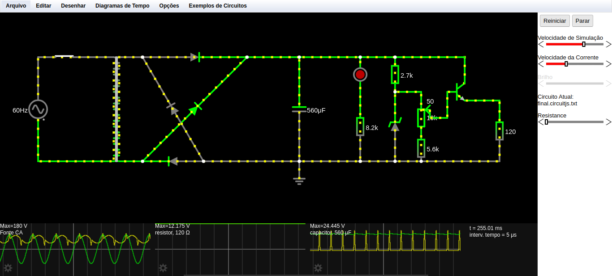

# Fonte Ajustável

## Descrição
Este é o primeiro trabalho de Eletrônica Digital, que envolve o projeto de uma Fonte de Tensão ajustável entre 3V a 12V com capacidade de 100mA.

## Componentes Utilizados

| Nº Componente | Componente          | Especificação        | Link para explicação detalhada                                    |
|---------------|---------------------|----------------------|-----------------------------------------------------------------|
|       1        |      Fonte         | Corrente Alternada 2 Terminais|  [Explicação da Fonte CA](#explicacao_fonte)           |
| 5             | Diodo               | 1N4004/1N4001        | [Explicação do Diodo](#explicacao_diodo)                        |
| 2             | Capacitor           | 560uF a 680uF         | [Explicação do Capacitor](#explicacao_capacitor)                |
| 2             | Diodo Zener -12     | 12,7V/13V             | [Explicação do Diodo Zener](#explicacao_diodo_zener)            |
| 1             | Potenciômetro       |     10k              | [Explicação do Potenciômetro](#explicacao_potenciometro)        |
| 4             | Resistores          | De 8.2KΩ à 120Ω                    | [Explicação dos Resistores](#explicacao_resistores)              |
| 3             | LED Vermelho        | 5mm                  | [Explicação do LED Vermelho](#explicacao_led)                   |
| 2             | Transistor         |   NPN                   | [Explicação do Transistor NPN](#explicacao_transistor_npn)      |
| 1             | Fusível             | loja                    | [Explicação do Fusível](#explicacao_fusivel)                    |
| 1             | Varistor            | loja                    | [Explicação do Varistor](#explicacao_varistor)                  |

   |        Resistores |    Especificação |
   | ------------------- | ------------------- |
   |           8.2KΩ   |          LED     |
   |        2.7KΩ      |    Diodo Zenner  |
   |        5.6KΩ      |       Potenciômetro |

## Explicações do uso dos componentes:

#### Diodo

- O diodo é um dispositivo que aqui será usado em conjunto, atuando 4 de uma vez na mesma área, porém, afetando todo o circuito. Esse conjunto é chamado de ponte de diodo, quando, claro, colocado em um circuito daquela forma. No circuito em si, é configurado como uma ponte retificadora, que converte corrente alternada em corrente contínua.

#### Capacitor

- O capacitor é utilizado para armazenar cargas elétricas e fornecer energia ao circuito quando necessário. No caso da fonte ajustável, ele ajuda a suavizar as flutuações de tensão e a estabilizar a saída.

#### Diodo Zener

- O diodo Zener é usado para regular a tensão no circuito. Ele permite que uma tensão específica seja mantida através dele, protegendo os componentes do circuito contra picos de tensão.

#### Potenciômetro

- O potenciômetro é um resistor variável que permite ajustar a tensão de saída da fonte conforme necessário. Ele é essencial para garantir que a fonte seja ajustável entre 3V a 12V.

#### Resistores

- O primeiro será para o LED, fazendo com que não passe uma potência tão grande;
   + O segundo será para o Diodo Zenner, já que para este, a tensão não deve ser tão alta, nem tão baixa também por causa da corrente mínima que o Zenner-12 requer;
       * O terceiro será para o final, fazendo com que, passado pelo Coletor do Transistor NPN, a tensão "original" com 100mA e 24V passe por este resistor de 120, chegando no final com 12V e 100mA;
          * E o quarto, e último, seria para limitarmos a queda de tensão no potenciômetro, indo de 12V para o mínimo de 3V, ao invés de 3mV.

#### LED Vermelho

- Os LEDs vermelhos são usados para indicar visualmente o funcionamento do circuito. Eles acendem quando a fonte de alimentação está ligada e funcionando corretamente.

#### Transistor NPN

- O transistor NPN aqui serve para a resolução do resistor do Zenner, já que queremos que ao final tenhamos 100mA e conservemos a voltagem "original", porém com 12V no final, sem ter o problema do Zenner-12 se alimentar um pouco desses 12V e não ter a tensão mínima requerida no final, enquanto mantém também esses 100mA 

#### Fusível

- O fusível é um dispositivo de segurança projetado para proteger o circuito elétrico contra correntes excessivas. Quando a corrente elétrica no circuito excede um certo limite seguro, o fusível se rompe, interrompendo assim o fluxo de corrente.

#### Varistor

- O varistor é um dispositivo de segurança projetado para proteger outros componentes do circuito contra picos de tensão. Ele possui uma resistência elétrica variável que diminui quando a tensão aplicada aumenta, permitindo que ele desvie a corrente excessiva para o solo e proteja o circuito contra danos causados por sobretensão.

#### Imagem do Circuito no Falstad

